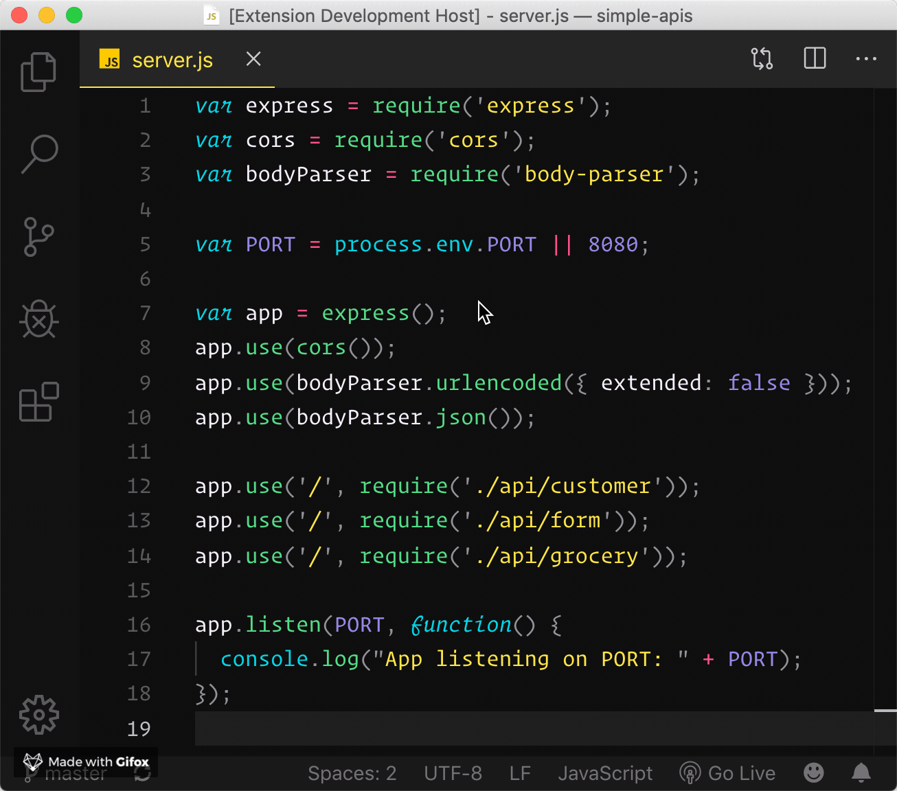

# VS Code Slack extension
Send your messages and files to Slack without leaving VS Code. Works with the latest API. (Updated 6/15/2020)

#### How it works?
* Upload file to Slack



* Send message to Slack


### Installation
You can install this extension by pressing F1 in Visual Studio Code, then typing "ex install" and selecting it from the list.

### Slack integration
Based on the latest updates on Slack API, you can no longer create legacy token to connect this extension to you Slack workspace. 

You have 2 options, create a Slack app yourself (1), or use the one I created (2):

1. Create a new Slack App from https://api.slack.com/apps/ and add the following OAuth Scopes to "Bot Token":

* incoming-webhook
* channels:read
* chat:write
* chat:write.customize
* files:write
* groups:read
* im:read
* mpim:read

You can then copy and paste the token into your VS Code settings file. The token should start with **"xoxb-"**.

1. <a href="https://slack.com/oauth/authorize?client_id=10638890021.1209235787632&scope=incoming-webhook,channels:read,chat:write,files:write,groups:read,im:read,mpim:read"></a>

**Do not forget to add the app's bot user to channels you want to post to.**

### VS Code Configuration
Go to User Settings (File > Preferences > User Settings) and add the following 
```
  "slackVSCode.token": "<your slack app's token>",
  "slackVSCode.listChannels": true,
  "slackVSCode.listGroups": false,
  "slackVSCode.listMembers": false,
  "slackVSCode.fileWithFullPath": true,
  "slackVSCode.excludeFromFullPath": "/Users/alper/dev",
  "slackVSCode.defaultRecipient": "<channel or user name i.e. #general></channel>"
```

* ##### `"token"` (required)
    * Read above on how to get a token.

* ##### `"listChannels"` (optional)
    * `true` for listing the slack channels

* ##### `"listGroups"` (optional)
    * `true` for listing the slack groups

* ##### `"listMembers"` (optional)
    * `true` for listing the slack members

* ##### `"fileWithFullPath"` (optional)
    * `true` if you want to send files with full path

* ##### `"excludeFromFullPath"` (optional)
    * String to exclude from the file full path i.e. `/Users/alper/dev`

* ##### `"defaultRecipient"` (optional)
    * The default recipient, to send the message directly without choosing from the drop down. i.e. `#general`, `@user`

### Features
* Send messages to
    * users
    * channels
    * private groups
* Can send message:
    * from selected code
    * from user input
* @user, #channel supported (at the beginning of message)
* Autofill last used channel/user/group
* Upload files
    * current open file
    * enter file path manually
    * selected text in open file
* Specify default recipient
* Limit channels/groups/members

### Shortcuts
* CTRL + ALT + SHIFT + M : Send new message
* CTRL + ALT + SHIFT + S : Send selection
* CTRL + ALT + SHIFT + U : Upload current file

### Feedback / Bug report / feature request
https://github.com/alperg/slack-vscode/issues

   
#### Credits
* Extension icon made by [Flat Icons](https://www.flaticon.com/authors/flat-icons/ "Flat Icons") from [flaticon.com](https://www.flaticon.com/ "Flaticon")

This extension is not created by, affiliated with, or supported by Slack Technologies, Inc.